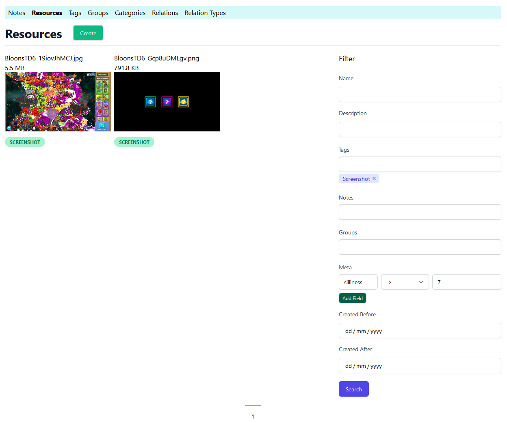

# mahresources

Just a simple CRUD app written in golang to serve my personal information management needs. 
It's surely an overkill for any imagination of my requirements but the thing is I like developing software more than
using software.

This thing has support for notes, resources (files), tags, groups (generic entity). Everything is taggable. 
Notes, resources and groups can have json metadata that's editable and queryable via the web GUI.
See the models folder for exact relation definitions.

It generates previews for videos and images, ffmpeg is needed for videos. Thumbnails are cached on the database. I
currently have 1.5 Million resources saved through it without problems.

It also has an API. The frontend routes also dump a JSON object will nearly all the data used to render it, when
accepts header is json, or you type ".json" at the end of the path (like /groups.json instead of /groups).

Supports postgres and sqlite only. Mysql support should be fairly easy to add, I just personally don't need it.

It has some minimal javascript. 90% of the things work without js too. Usually. HTML doesn't have automatic 
auto-completers, so they become useless without JS, rendering some forms broken. All included js has integrity checks so
there's at least that. npm is not in play other than generating css, which is committed, so you don't need it unless you
want new utility classes.

## Build

First, set the necessary env variables that are catalogued in the `.env.template` file. You can also create a 
copy of the file, rename it to `.env` and customize the values.

I use compiledaemon for continuous builds as I develop:

`CompileDaemon -exclude-dir=".git" -exclude-dir="node_modules" -command="./mahresources" -build="go build --tags json1"`

Just do `go build --tags json1` if you want to have a single build.

### Optional

To build css, install node, run `npm ci` first and do `npm run build-css` to get an optimized Tailwind css file. 
You can also start a watcher for that via `npm run css-gen`. The generated css, as mentioned before, is committed. You
don't need to do this if you don't need additional utility classes.

### Scripting

You probably need to import your own data, and you can do it via the HTTP API, or you can directly use the library
functions. For an example, see /cmd/importExisting/main.go, which can be run like 
`go run ./cmd/importExisting/main.go -target "/some/folder" -ownerId 1234`.

The structure is very modular. I'll make it even more so
as I continue to develop. 

## Security

There is zero security. No authorization or authentication, or even user accounts, really. This is thought to be run
on private networks or behind some sort of security layer like a firewall. 

# Help me

If you have any experience on tagging photos automatically (tensorflow stuff), any help is appreciated. I'll also come 
around to it eventually (probably), but I'm very open to help.

## Random Screenshot

See how it is possible to query via the Meta field (JSON). Currently, there are more fields, and you can actually sort
and bulk edit the results. I'd rather keep developing than adding up-to-date screenshots though. Trust me, it looks OK.

## maybe do

- [ ] detect similar images
- [ ] Make note categories work
- [X] Sorting lists
- [X] Inline add for tags, groups, categories, and so on
- [X] bulk editor for lists
- [ ] Breadcrumbs for groups
- [X] video preview generation
- [ ] faster image previews with libvips?
- [X] support multiple file system attach points
- [ ] some integration tests, perhaps behavioral test
- [ ] importers like perkeep? maybe.
- [ ] sync could be interesting
