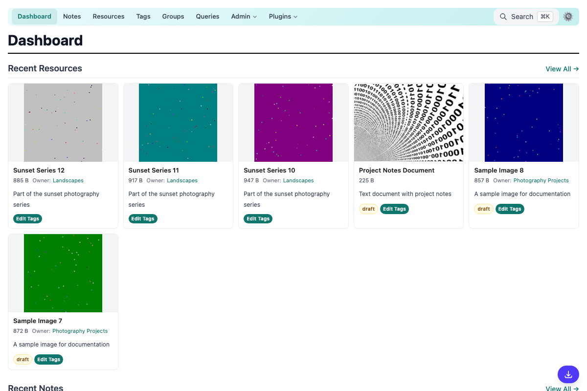
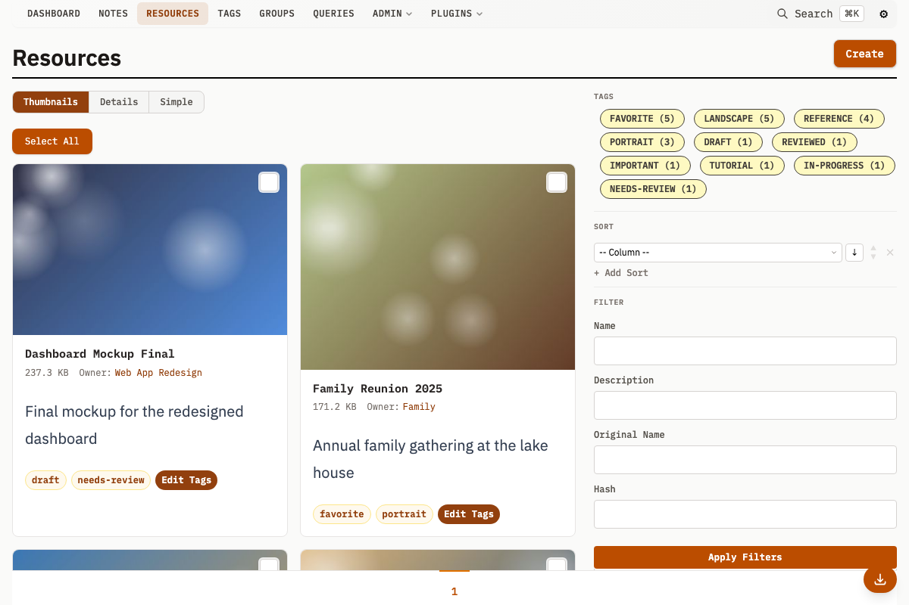
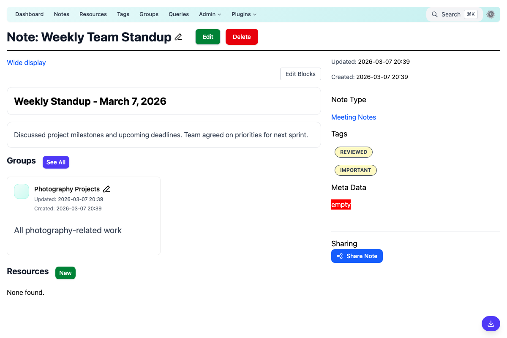
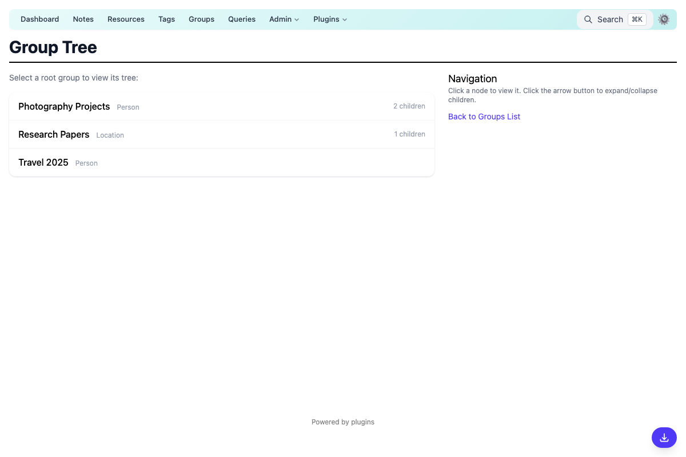
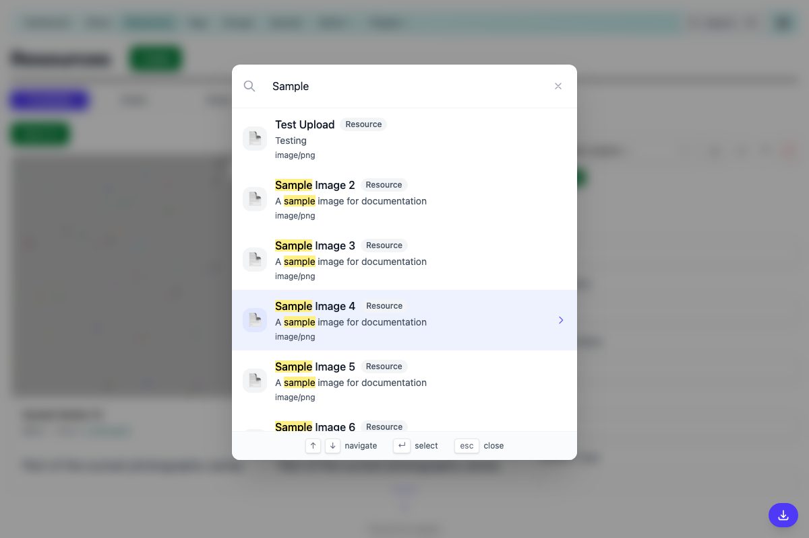
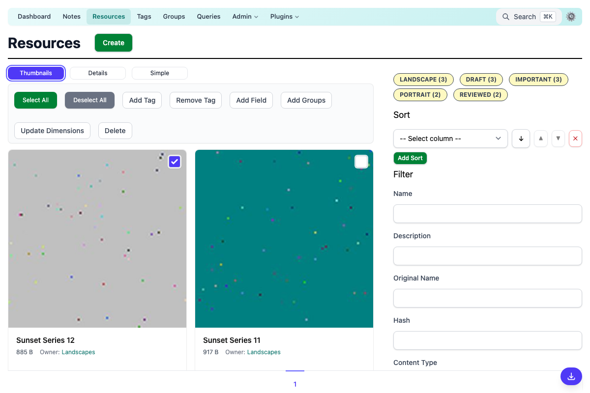

# mahresources

A personal information management system built in Go. Organize files, notes, and collections with rich metadata, full-text search, and a flexible tagging system — designed to scale to millions of resources.

**[Read the full documentation](https://egeozcan.github.io/mahresources/)**

## Screenshots

<table>
  <tr>
    <td align="center">
      <br>
      <em>Dashboard</em>
    </td>
    <td align="center">
      <br>
      <em>Resource Grid</em>
    </td>
  </tr>
  <tr>
    <td align="center">
      <br>
      <em>Note Blocks</em>
    </td>
    <td align="center">
      <br>
      <em>Group Tree</em>
    </td>
  </tr>
  <tr>
    <td align="center">
      <br>
      <em>Global Search (Cmd/Ctrl+K)</em>
    </td>
    <td align="center">
      <br>
      <em>Bulk Operations</em>
    </td>
  </tr>
</table>

## Features

- **Resources** — Store and manage files with automatic thumbnail generation, perceptual hashing for duplicate/similarity detection, and version tracking
- **Notes** — Rich text content with structured block types and sharing capabilities
- **Groups** — Hierarchical collections with typed relationships between them
- **Tags & Categories** — Flexible labeling system across all entity types
- **Full-Text Search** — Fast search across all content with saved queries
- **JSON Metadata** — Attach queryable JSON metadata to any entity, with schema validation
- **Bulk Operations** — Tag, merge, delete, or update many items at once
- **Plugin System** — Extend functionality with Lua plugins, custom actions, and hooks
- **Dual API** — Every route serves both HTML and JSON (append `.json` or set `Accept: application/json`)
- **SQLite & Postgres** — Choose the database that fits your needs

## Quick Start

```bash
# Build everything (CSS + JS + Go binary)
npm run build

# Run in ephemeral mode (in-memory, no persistence — great for trying it out)
./mahresources -ephemeral

# Or with persistent storage
./mahresources -db-type=SQLITE -db-dsn=mydb.db -file-save-path=./files
```

See the [installation guide](https://egeozcan.github.io/mahresources/docs/getting-started/installation) for detailed setup instructions.

## Configuration

| Flag | Description |
|------|-------------|
| `-file-save-path` | Main file storage directory |
| `-db-type` | Database type: `SQLITE` or `POSTGRES` |
| `-db-dsn` | Database connection string |
| `-bind-address` | Server address:port (default `:8181`) |
| `-ephemeral` | Run fully in-memory (no persistence) |

See the [full configuration reference](https://egeozcan.github.io/mahresources/docs/configuration/overview) for all options including ephemeral modes, seed databases, alternative filesystems, and remote timeouts.

## Testing

```bash
# Go unit tests
go test ./...

# E2E tests (starts ephemeral server automatically)
cd e2e && npm run test:with-server
```

See the [docs](https://egeozcan.github.io/mahresources/docs/getting-started/installation#e2e-tests) for more test commands and options.

## Documentation

The full documentation covers everything in detail:

- [Getting Started](https://egeozcan.github.io/mahresources/docs/getting-started/installation) — Installation, first steps, quick start
- [Concepts](https://egeozcan.github.io/mahresources/docs/concepts/overview) — Resources, notes, groups, tags, relationships
- [User Guide](https://egeozcan.github.io/mahresources/docs/user-guide/navigation) — Navigation, search, bulk operations
- [Features](https://egeozcan.github.io/mahresources/docs/features/thumbnail-generation) — Thumbnails, versioning, plugins, saved queries
- [Configuration](https://egeozcan.github.io/mahresources/docs/configuration/overview) — All settings and deployment options
- [API Reference](https://egeozcan.github.io/mahresources/docs/api/overview) — REST API documentation

**[Browse the docs](https://egeozcan.github.io/mahresources/)**

## Security

There is no built-in authentication or authorization. This application is designed to run on private networks or behind a reverse proxy that handles access control. See the [reverse proxy guide](https://egeozcan.github.io/mahresources/docs/deployment/reverse-proxy) for setup instructions.

## Scripting & Import

The HTTP API supports all CRUD operations, making it straightforward to script bulk imports. For an example of direct library usage, see `cmd/importExisting/main.go`. The [API documentation](https://egeozcan.github.io/mahresources/docs/api/overview) covers all available endpoints.
