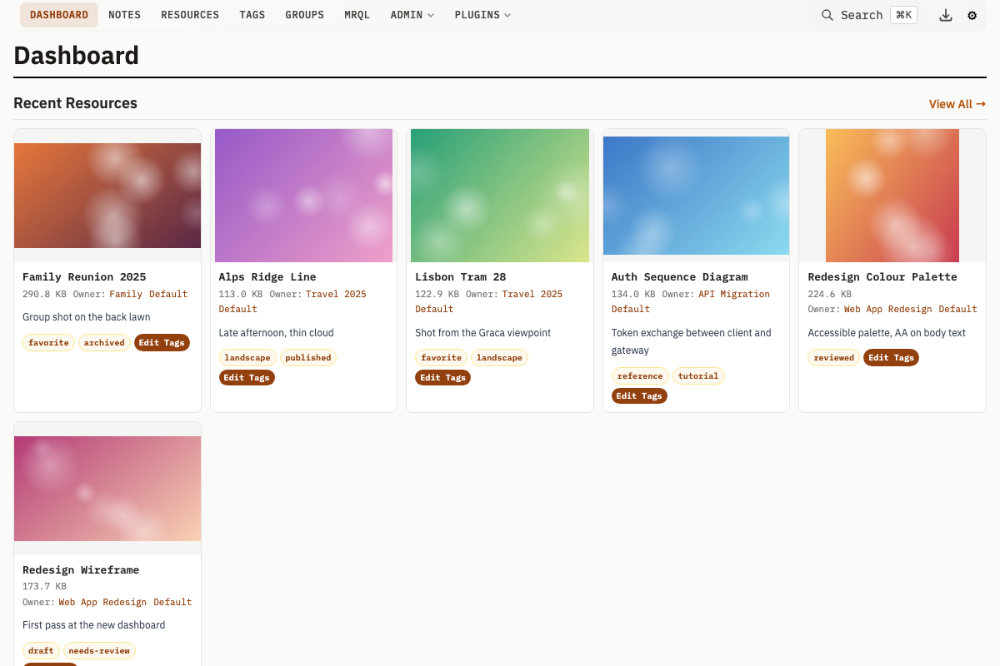
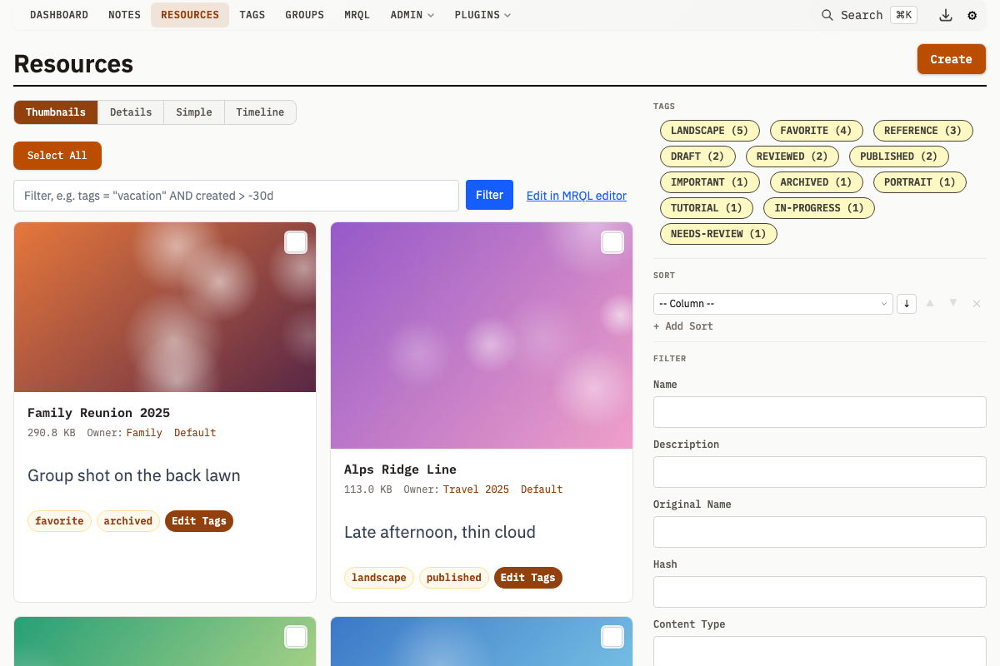
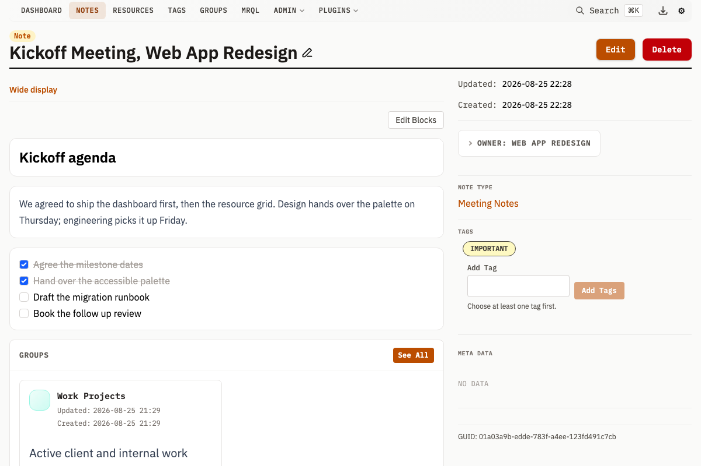
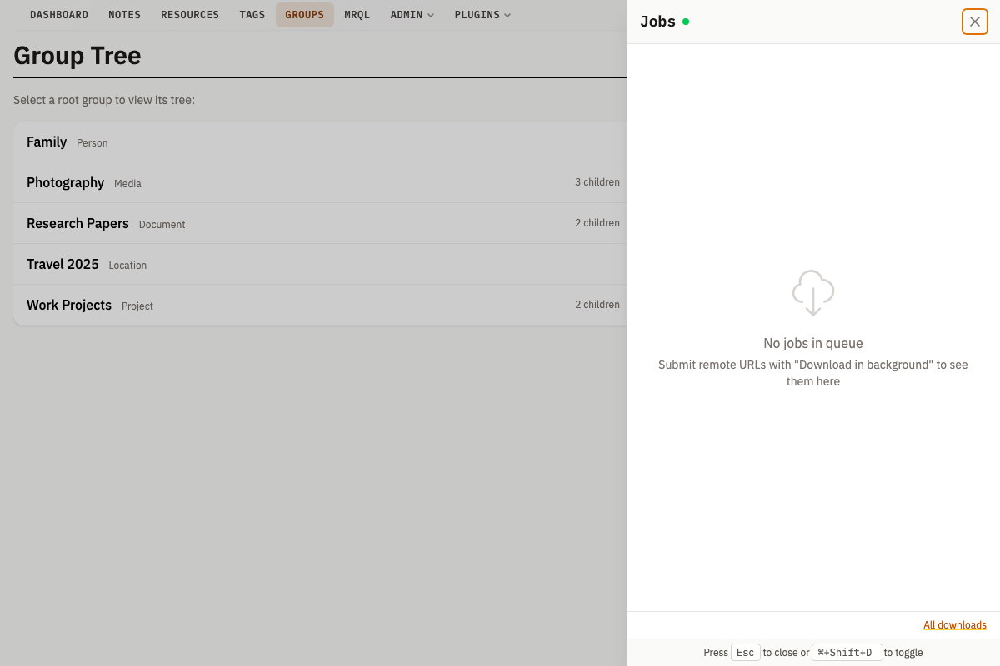
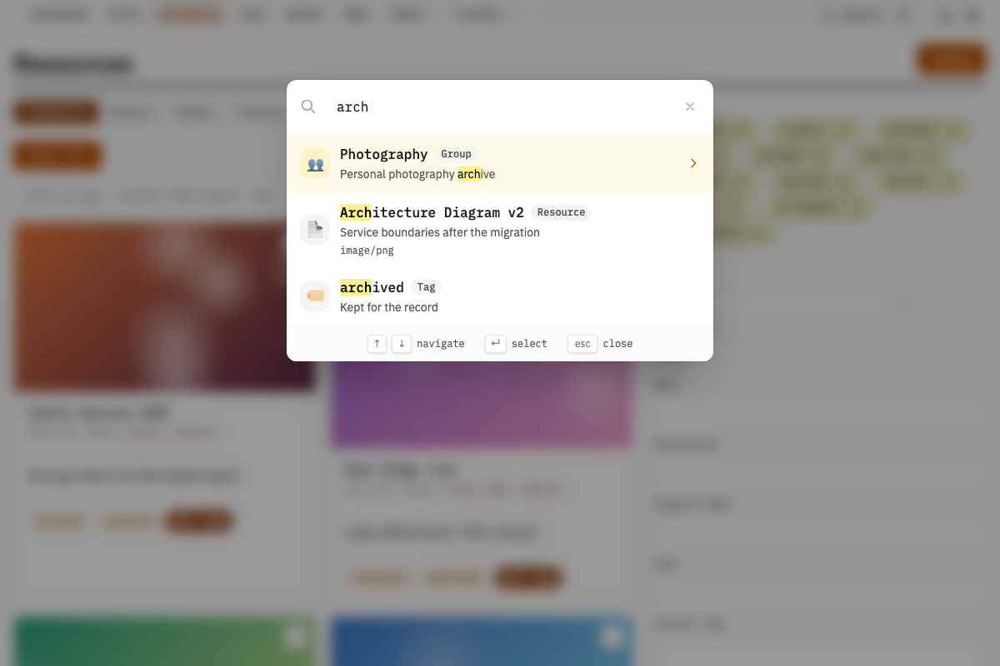
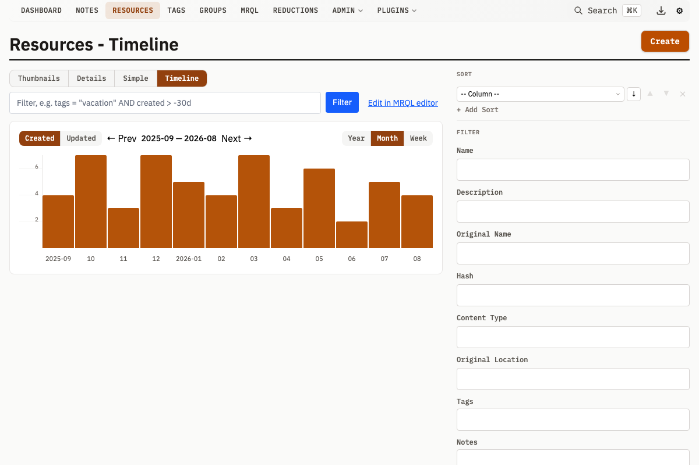

# Mahresources

Mahresources is a self-hosted system for storing files, writing notes, and linking them together. It runs as a single Go binary with SQLite or PostgreSQL, and serves a web UI for browsing, searching, and editing everything. It is designed to work with libraries of millions of resources.

**[Read the full documentation](https://egeozcan.github.io/mahresources/)**

## Screenshots

<table>
  <tr>
    <td align="center">
      <br>
      <em>Dashboard</em>
    </td>
    <td align="center">
      <br>
      <em>Resource Grid</em>
    </td>
  </tr>
  <tr>
    <td align="center">
      <br>
      <em>Note Blocks</em>
    </td>
    <td align="center">
      <br>
      <em>Group Tree</em>
    </td>
  </tr>
  <tr>
    <td align="center">
      <br>
      <em>Global Search (Cmd/Ctrl+K)</em>
    </td>
    <td align="center">
      <br>
      <em>Timeline View</em>
    </td>
  </tr>
</table>

## What It Does

Files (called **Resources**), **Notes**, and **Groups** live in a database with tracked relationships and full-text search. Groups nest inside each other and hold any mix of Resources and Notes. **Tags** and **Categories** classify items across the hierarchy.

### Content

- **Resources** - any file type, with automatic thumbnails (images natively, video through FFmpeg, Office documents through LibreOffice), perceptual hashing for similarity detection, and full version history
- **Notes** - text content assembled from typed **note blocks**: text, heading, divider, gallery, references, todos, table, and calendar. Plugins can register more block types
- **Groups** - a nested hierarchy that owns Resources, Notes, and other Groups, plus typed **relations** between Groups ("works at", "parent of")
- **Series** - Resources that share metadata, such as the pages of one scanned document
- **Tags, Categories, Resource Categories, and Note Types** - flat labels, and types that give each entity its own presentation

### Finding Things

- **Full-text search** across all content, via FTS5 on SQLite or tsvector on PostgreSQL, reachable from anywhere with Cmd/Ctrl+K
- **MRQL** - a query language for Resources, Notes, and Groups, with its own page at `/mrql`, a filter bar on every list page, saved queries, and an `[mrql]` shortcode that embeds results in templates
- **Saved queries** - stored raw SQL with custom result templates; point `DB_READONLY_DSN` at a read-only connection to enforce that at the database level
- **Timeline view** and **image similarity** browsing

### Working With Data

- **Bulk operations** - tag, merge, delete, or edit metadata across many items at once
- **Resource Reduction** - a workspace for collapsing repeated Resources. Clusters of repeats are proposed for review, and nothing is deleted until you approve it
- **Group export / import** - move a Group subtree, with its resources, notes, tags, and categories, through a self-contained tar archive
- **Download queue** - submit remote URLs, watch them in the Download Cockpit, and retry from persisted history
- **Meta schemas** - a JSON Schema on each Category, Resource Category, or Note Type that validates metadata and generates a form for it
- **Custom templates** - HTML fragments with server-side shortcodes, rendered into slots on detail pages, cards, hover cards, and list pages
- **Note sharing** - publish an individual note on a separate read-only server behind an unguessable token
- **Activity log** - create, update, delete, and plugin operations across every entity

### Extending and Integrating

- **Plugins** - sandboxed Lua that hooks writes, adds pages and JSON endpoints, runs background and scheduled jobs, serves its own static assets, and keeps per-plugin data in a key-value store
- **JSON API** - every route serves both HTML and JSON (append `.json` or send `Accept: application/json`)
- **`mr` CLI** - a command-line client covering the same API
- **Optional accounts and RBAC** - four roles with group-subtree scoping, off by default

## Requirements

- **Go 1.26+**
- **Node.js 20.19+ or 22.12+** - the range Vite 8 supports; older 20.x and 22.x releases fail `npm install` with `EBADENGINE`
- **A C compiler** - the SQLite driver is cgo-based. Do not set `CGO_ENABLED=0`, or the binary builds without working SQLite

FFmpeg (video thumbnails), LibreOffice (document thumbnails), and ImageMagick (HEIC and AVIF) are optional and detected on `PATH`.

## Quick Start

```bash
git clone https://github.com/egeozcan/mahresources.git
cd mahresources
npm install
npm run build
```

`npm run build` compiles Tailwind CSS, bundles JavaScript with Vite, and builds the Go binary with the `json1` and `fts5` tags.

```bash
# Ephemeral mode: in-memory database and filesystem, nothing persists
./mahresources -ephemeral

# Persistent storage
./mahresources -db-type=SQLITE -db-dsn=mydb.db -file-save-path=./files
```

The server listens on `:8181` by default. Start it from the repository root: the binary is not self-contained and loads Pongo2 templates from `./templates` and static assets from `./public`, both relative to the working directory.

No Docker image is published, but the repository builds one -- see the [installation guide](https://egeozcan.github.io/mahresources/getting-started/installation) and the [Docker deployment guide](https://egeozcan.github.io/mahresources/deployment/docker).

## Configuration

Settings come from environment variables (a `.env` file works) or command-line flags. Flags take precedence.

| Flag | Description |
|------|-------------|
| `-file-save-path` | Main file storage directory |
| `-db-type` | Database type: `SQLITE` or `POSTGRES` |
| `-db-dsn` | Database connection string |
| `-bind-address` | Server address:port (default `:8181`) |
| `-ephemeral` | Run fully in-memory, with no persistence |
| `-auth` | Enable user accounts and RBAC (off by default) |
| `-plugin-path` | Directory scanned for plugins (default `./plugins`) |
| `-share-port` | Port for the public share server (empty disables note sharing) |

Roughly sixty more flags cover thumbnails, hashing, timeouts, alternative filesystems, seeded ephemeral modes, and job limits. Some are editable at runtime from `/admin/settings` without a restart. See the [configuration reference](https://egeozcan.github.io/mahresources/configuration/overview).

## Security

Authentication is **off by default**. With `-auth` unset there is no login page and no permission checks: every request runs as an implicit administrator. That is the historical behavior, and it assumes a private, trusted network.

> **Do not expose an unprotected instance to the internet.** For remote access, put it behind a reverse proxy that enforces authentication (nginx with basic auth, OAuth2 Proxy, Authelia). See the [reverse proxy guide](https://egeozcan.github.io/mahresources/deployment/reverse-proxy).

When you need accounts, turn them on with `-auth`. Requests then authenticate with a session cookie or a per-user API token, and four roles apply:

- **admin** - full access, including settings, plugins, and user administration
- **editor** - CRUD on entities, but no categories and no system settings
- **user** - CRUD on resources and notes, optionally confined to one Group's subtree
- **guest** - read-only, always confined to one Group's subtree

Scoped users and guests are held to their subtree across lists, reads, search, MRQL, file serving, and writes. Bootstrap the first account with `-create-admin-user` and `-create-admin-password`. Built-in auth can be combined with a reverse proxy. See [Authentication & RBAC](https://egeozcan.github.io/mahresources/features/authentication).

## The `mr` CLI

`mr` is a command-line client for the HTTP API, covering every entity type with CRUD, bulk actions, file upload and download, versions, jobs, plugins, MRQL, and administration.

```bash
npm run build-cli     # produces ./mr
make install-cli      # optional: install it onto your PATH
```

```bash
mr resources list --content-type image/jpeg
mr resource upload ./photo.jpg --owner-id 3 --meta '{"camera":"Pixel"}'
mr mrql 'type = resource AND tags = "photo" AND created > -7d'
```

Against a server running with `-auth`, authenticate once with `mr auth login`, or set `MR_TOKEN` to an API token. See the [CLI reference](https://egeozcan.github.io/mahresources/cli/).

## Development

```bash
make help          # list every target
make build         # CSS + JS bundle + Go binary
make dev           # watch and rebuild (requires CompileDaemon)
make test          # Go tests + frontend unit tests
make test-e2e-all  # browser and CLI e2e suites in parallel
make ci            # the main local CI checks
```

E2E tests run against an ephemeral server that the scripts start and stop themselves, so they never touch real data. The Playwright suite lives in `e2e/`, and includes accessibility tests (`make test-a11y`), CLI tests, and a Postgres run. `npm run build-js` must be re-run after editing anything under `src/`, and its output in `public/dist/` is committed.

## Documentation

- [Getting Started](https://egeozcan.github.io/mahresources/getting-started/installation) - installation, quick start, first steps
- [Core Concepts](https://egeozcan.github.io/mahresources/concepts/overview) - resources, notes, groups, tags, relationships, series
- [User Guide](https://egeozcan.github.io/mahresources/user-guide/navigation) - navigation, search, bulk operations
- [Configuration](https://egeozcan.github.io/mahresources/configuration/overview) - every flag and runtime setting
- [Advanced Features](https://egeozcan.github.io/mahresources/features/mrql) - MRQL, plugins, templates, versioning, export/import
- [CLI Reference](https://egeozcan.github.io/mahresources/cli/) - every `mr` command
- [API Reference](https://egeozcan.github.io/mahresources/api/overview) - REST endpoints
- [Deployment](https://egeozcan.github.io/mahresources/deployment/docker) - Docker, systemd, reverse proxy, backups

The OpenAPI spec is generated from the routes themselves with `make openapi`.

## Scripting and Import

Every page has a JSON equivalent, so bulk imports can be written as HTTP scripts. `cmd/importExisting/main.go` is an example of driving the application context directly as a library instead.

## License

[GNU Affero General Public License v3.0](LICENSE).
